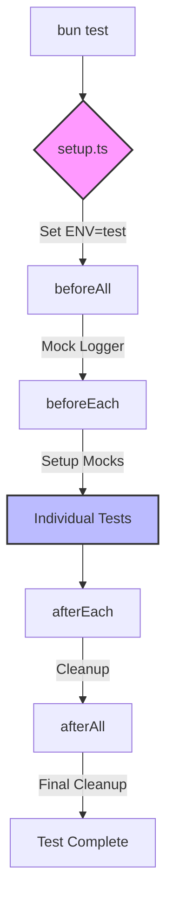
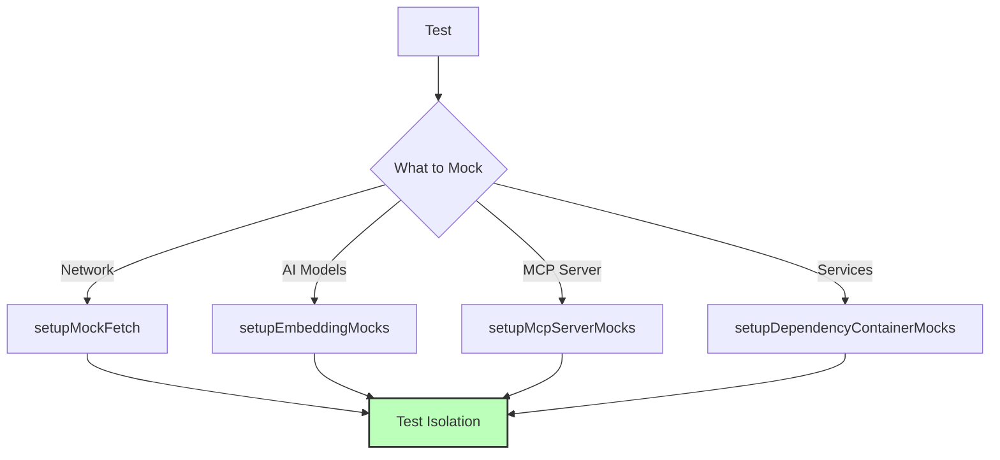

# Test Architecture

This document describes the testing architecture for the Personal Brain project.

## Test Structure

```
tests/
├── commands/              # Command-line interface tests
├── interfaces/            # Interface implementation tests
├── mcp/                   # Model-Context-Protocol tests
│   ├── contexts/          # Context layer tests
│   │   ├── __mocks__/     # Mock implementations for contexts
│   │   ├── externalSources/
│   │   ├── notes/
│   │   └── profiles/
│   ├── model/             # Model layer tests
│   └── protocol/          # Protocol layer tests
├── models/                # Data model tests
├── services/              # Service layer tests
│   ├── __mocks__/         # Mock implementations for services
│   ├── notes/
│   └── profiles/
└── utils/                 # Utility function tests
    ├── cliUtils.ts        # CLI test utilities
    ├── dependencyUtils.ts # Dependency injection utilities
    ├── embeddingUtils.ts  # Embedding test utilities
    ├── envUtils.ts        # Environment variable utilities
    ├── fetchUtils.ts      # Network request utilities
    ├── mcpUtils.ts        # MCP-specific test utilities
    └── index.ts           # Centralized exports
```

## Flow of Test Execution



## Mocking Architecture



## Using the Testing Framework

### Basic Test Structure

```typescript
import { test, expect, describe } from 'bun:test';
import { YourClass } from '@/path/to/your/module';
import { createMockData } from '@test';

describe('YourClass', () => {
  test('should do something specific', () => {
    // Arrange
    const instance = new YourClass();
    const mockData = createMockData();
    
    // Act
    const result = instance.yourMethod(mockData);
    
    // Assert
    expect(result).toBe(expectedValue);
  });
});
```

### Using Mocks

```typescript
import { test, expect, mock } from 'bun:test';
import { setupMockFetch } from '@test';

test('should handle network requests', async () => {
  // Setup mock fetch
  global.fetch = setupMockFetch({
    data: { success: true }
  });
  
  // Call code that uses fetch
  const result = await yourFetchingFunction();
  
  // Verify result
  expect(result.success).toBe(true);
});
```

### Dependency Injection Testing

```typescript
import { setupDependencyContainerMocks } from '@test';

test('should use mock dependencies', () => {
  // Create mock services
  const mockService = {
    doSomething: () => 'mocked result'
  };
  
  // Setup dependency container
  setupDependencyContainerMocks(mock, {
    'service.id': mockService
  });
  
  // Your code will now use the mock service
});
```

## Best Practices

1. **Import from @test**: Always import test utilities from the centralized location
   ```typescript
   import { createMockNotes, setupEmbeddingMocks } from '@test';
   ```

2. **Test Isolation**: Create fresh instances and use mocks to prevent tests from affecting each other
   ```typescript
   // Good: Create a new instance for each test
   test('test 1', () => {
     const instance = new Service();
     // Test with isolated instance
   });
   
   test('test 2', () => {
     const instance = new Service();
     // Another test with its own instance
   });
   ```

3. **Centralized Setup**: Use the global setup file for common test configuration
   ```typescript
   // setup.ts handles:
   // - Setting test environment
   // - Mocking the logger
   // - Setting up embedding mocks
   // - Setting up fetch mocks
   ```

4. **Descriptive Test Names**: Use clear, descriptive names that explain the test's purpose
   ```typescript
   // Good:
   test('should calculate similarity between embeddings correctly', () => {
     // Test code
   });
   
   // Bad:
   test('similarity test', () => {
     // Test code
   });
   ```