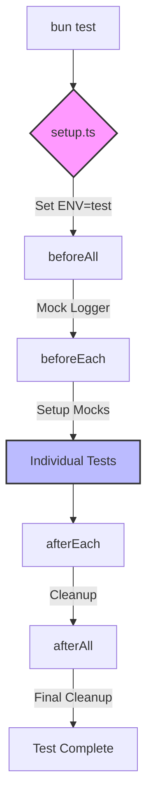
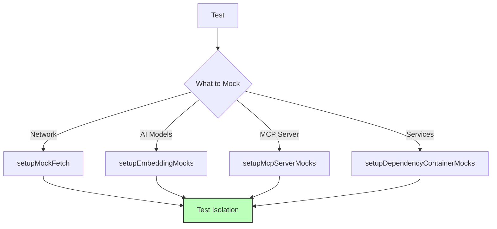

# Test Architecture

This document describes the testing architecture for the Personal Brain project.

## Test Structure

```
tests/
├── __mocks__/             # Centralized mock implementations
│   ├── contexts/          # Context mock implementations
│   ├── core/              # Core service mock implementations
│   ├── models/            # Model mock implementations
│   ├── protocol/          # Protocol component mock implementations
│   ├── repositories/      # Repository mock implementations
│   ├── services/          # Service mock implementations
│   ├── storage/           # Storage mock implementations
│   └── utils/             # Utility mock implementations
├── commands/              # Command-line interface tests
├── helpers/               # Test helper functions
│   ├── di/                # Dependency injection helpers
│   ├── envUtils.ts        # Environment variable test utilities
│   ├── index.ts           # Main helper exports
│   └── outputUtils.ts     # Console/output capture utilities
├── interfaces/            # Interface implementation tests
├── mcp/                   # Model-Context-Protocol tests
│   ├── contexts/          # Context layer tests
│   ├── model/             # Model layer tests
│   └── protocol/          # Protocol layer tests
├── models/                # Data model tests
├── services/              # Service layer tests
│   ├── notes/
│   └── profiles/
└── utils/                 # Utility function tests
```

## Flow of Test Execution



## Mocking Architecture



## Using the Testing Framework

### Basic Test Structure

```typescript
import { test, expect, describe } from 'bun:test';
import { YourClass } from '@/path/to/your/module';
import { createMockData } from '@test/__mocks__/models/yourModel';

describe('YourClass', () => {
  test('should do something specific', () => {
    // Arrange
    const instance = new YourClass();
    const mockData = createMockData();
    
    // Act
    const result = instance.yourMethod(mockData);
    
    // Assert
    expect(result).toBe(expectedValue);
  });
});
```

### Using Mock Environment

```typescript
import { test, expect, beforeAll, afterAll } from 'bun:test';
import { setMockEnv, clearMockEnv } from '@test/helpers/envUtils';

describe('Your Component', () => {
  beforeAll(() => {
    // Setup standardized test environment
    setMockEnv();
    // Add additional environment variables if needed
    setTestEnv('CUSTOM_VARIABLE', 'test-value');
  });
  
  afterAll(() => {
    // Clean up standardized environment
    clearMockEnv();
    // Clean up additional variables if needed
    clearTestEnv('CUSTOM_VARIABLE');
  });
  
  test('should work with environment vars', async () => {
    // Your component will now use mock environment variables
  });
});
```

### Using Fetch Mocks

```typescript
import { test, expect } from 'bun:test';
import { mockFetch } from '@test/helpers/outputUtils';

test('should handle network requests', async () => {
  // Setup mock fetch
  const restoreFetch = mockFetch({
    data: { success: true }
  });
  
  try {
    // Call code that uses fetch
    const result = await yourFetchingFunction();
    
    // Verify result
    expect(result.success).toBe(true);
  } finally {
    // Restore original fetch
    restoreFetch();
  }
});
```

### Dependency Injection Testing

```typescript
import { setupDependencyContainer } from '@test/helpers/di/containerUtils';

test('should use mock dependencies', () => {
  // Create isolated test container
  const { cleanup } = setupDependencyContainer();
  
  try {
    // Your code will now use the isolated container
    // which can be configured for the specific test
  } finally {
    // Clean up the container
    cleanup();
  }
});
```

## Best Practices

1. **Use Standardized Patterns**: Import mock/helper utilities from their standardized locations
   ```typescript
   // Good:
   import { createMockNote } from '@test/__mocks__/models/note';
   import { setMockEnv, clearMockEnv } from '@test/helpers/envUtils';
   import { mockFetch } from '@test/helpers/outputUtils';
   
   // Bad - using inconsistent patterns:
   import { createMockNote } from '../../../__mocks__/models/note';
   ```

2. **Singleton Pattern for Mocks**: Use getInstance(), resetInstance(), and createFresh() methods consistently
   ```typescript
   // For singleton access (shared state):
   const context = ConversationContext.getInstance();
   
   // For test isolation (fresh instance):
   const context = ConversationContext.createFresh();
   
   // For cleanup between tests:
   ConversationContext.resetInstance();
   ```

3. **Test Isolation**: Create fresh instances and use mocks to prevent tests from affecting each other
   ```typescript
   // Good: Create a new instance for each test
   test('test 1', () => {
     const context = ConversationContext.createFresh();
     // Test with isolated instance
   });
   
   test('test 2', () => {
     const context = ConversationContext.createFresh();
     // Another test with its own instance
   });
   ```

4. **Centralized Environment Setup**: Use standardized environment helpers
   ```typescript
   // In beforeAll/beforeEach:
   setMockEnv(); // Sets up standard test environment
   
   // In afterAll/afterEach:
   clearMockEnv(); // Cleans up standard test environment
   ```

5. **Descriptive Test Names**: Use clear, descriptive names that explain the test's purpose
   ```typescript
   // Good:
   test('should calculate similarity between embeddings correctly', () => {
     // Test code
   });
   
   // Bad:
   test('similarity test', () => {
     // Test code
   });
   ```

6. **Use Helpers for Common Tasks**: Leverage helper functions for repetitive test operations
   ```typescript
   // For mocking console output:
   const { getOutput, restore } = captureOutput();
   try {
     // Run function that produces console output
     expect(getOutput()).toContain('Expected output');
   } finally {
     restore(); // Clean up
   }
   ```